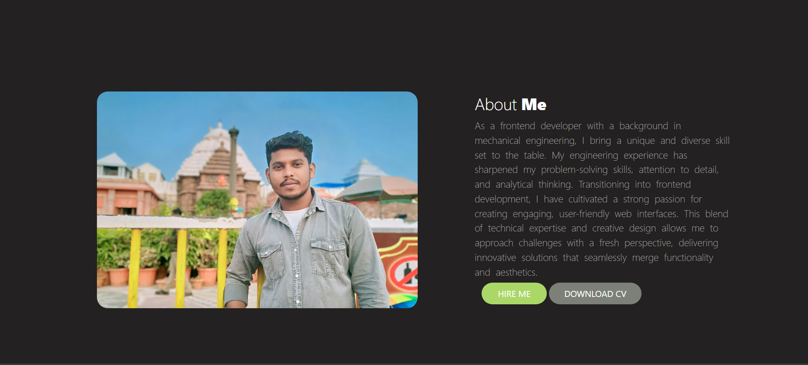
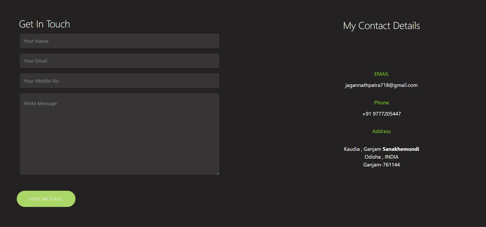

# Simple HTML Portfolio 🌐

Personal portfolio website built with **pure HTML, CSS, JavaScript**. Responsive design, contact form, and smooth scrolling. Created in VS Code.[web:17]

🔗 [Click here to view the live app](https://jagannath741.github.io/Jagannath-portfolio/)

 <!-- Replace with your screenshot path -->
 <!-- Replace with your screenshot path -->
 <!-- Replace with your screenshot path -->

## ✨ Features
- Responsive navbar & sections (mobile-first CSS).
- About, Projects, Skills, Contact pages.
- JS animations & form validation.
- No frameworks – vanilla code only.

## 🛠️ Tech Stack
- **HTML5**
- **CSS3** (Flexbox/Grid)
- **Vanilla JavaScript**
- **VS Code** for editing/deploy

## 🚀 Quick Start (VS Code)
1. Clone: `git clone <your-repo>`
2. Open: `code .`
3. Edit `index.html`, `style.css`, `script.js`
4. Preview: Right-click `index.html` > Open with Live Server
5. Deploy: Push to GitHub Pages or Netlify

## 📁 File Structure
